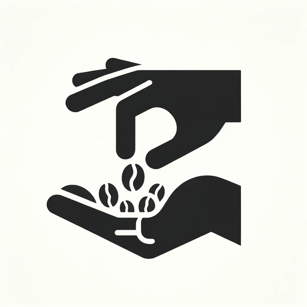
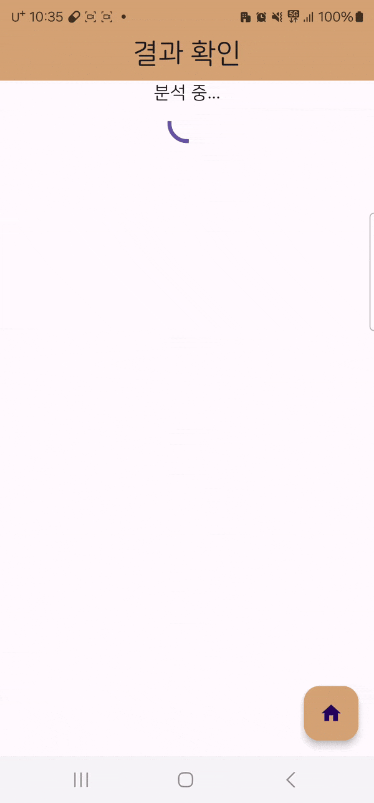
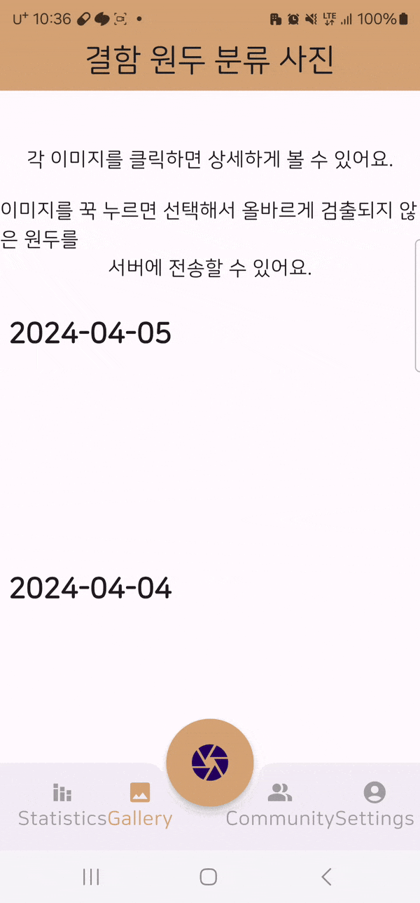
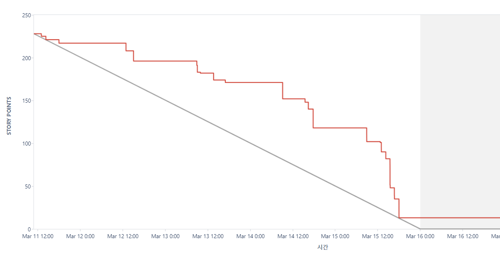
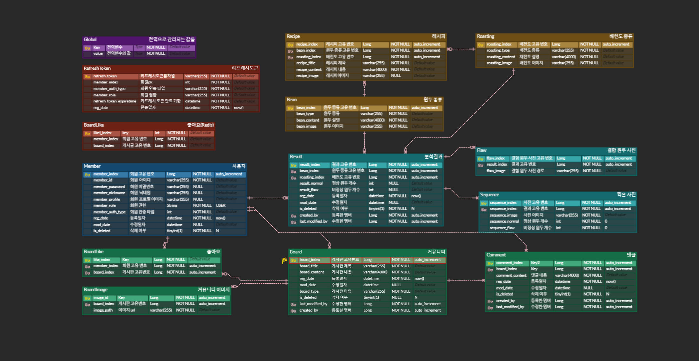

# Copick

 

## 소개

원두 결점 실시간 검출 및 분석 서비스를 제공하는 커뮤니티 앱

 

## 기술 스택

### FrontEnd

### BackEnd

### Infra

### AI

### 협업 툴

  

# 목차

1. [개요](#개요)
2. [주요 기능](#주요-기능)
3. [서비스 화면](#서비스-화면)
4. [협업 환경](#협업-환경)
5. [기술 소개](#기술-소개)
6. [팀원 소개](#팀원-소개)

  

## 개요

프로젝트 정보(개발기간, 팀원)
2024.02.19 ~ 2024.04.04

프로젝트 개요 (프로젝트를 문장으로 소개하삼 음슴체ㄴㄴ)

- 원두 핸드픽이 힘드신 홈 바리스타들을 위해, AI를 사용해서 도와드립니다.

## 주요 기능

- 로스팅한 원두를 카메라로 확인했을 때 실시간으로 불량을 검출
- 사진 촬영을 진행하면 사진을 분석하여 불량 원두를 검출하고 서버로 전송하여 갤러리에 저장
- 불량 원두 검출 사진을 확인하고 정상으로 판단되는 원두가 발견될 시 서버에 전송하여
   
  향후 검출 정확도를 향상
- 정상, 불량 원두에 대한 통계를 확인하고 다른 사용자와의 비교를 통해 정상원두 비율을 확인
- 커뮤니티 기능을 통해 다른 사용자와 상호작용하고 정보를 공유

 

## 서비스 화면

  
  
  

  
  
  

  

## 협업 환경

### JIRA

매주 월요일 오전 9시 30분 스프린트 회의를 통해 그 전주의 이슈를 공유하고 이번주 목표를 세우고 목표 달성을 위한 구체적인 작업을 정리합니다.

공통적인 일정 관리와 파트별 회의, 개인 개발 일정까지 모두 공유하며 구체적으로 이슈를 관리합니다.

이를 위해 사용된 요소들은 다음과 같습니다.

- Epic : `FE`, `BE`, `INFRA`, `DL(Deep Learning)` 
  각 에픽에 맞게 스토리 및 태스크를 작성하였습니다.
- 번다운 차트
  

### GIT

컨벤션 설정을 통해 규칙을 정하고 GERRIT을 함께 활용하여 서로의 코드에 코멘트를 남겨 보완할 수 있도록 합니다.

- GIT 컨벤션
  

### Notion

`기능명세서`, `일정`, `이슈 발생 상황`, `환경설정 메뉴얼 ` 등 프로젝트 문서들을 공유 공간에서 통합적으로 관리하고 효과적으로 의사소통합니다.

  

### 시스템 구성도

 

### ERD

  

# 팀원 소개

**FRONTEND**

` 이호성`(FE 리더) : Flutter 디자인 및 기능 구현  
`강보훈`: Flutter 디자인 및 기능 구현 | on device AI  `전재우`(Team 리더) : AI 모델 설정 및 학습  

**BACKEND**

`남찬현`(BE 리더) : Spring API | BACKEND 아키텍처 설계 | on device AI  
`이효재` : Spring API| FastAPI(Python) API | DB 아키텍쳐 설계  
`정지훈` : Infra | System 아키텍처 설계 | Security | CI/CD

# 배포 주소

**안드로이드 앱 : [원스토어](https://m.onestore.co.kr/mobilepoc/apps/appsDetail.omp?prodId=0000775209)**

**웹사이트 : [https://copick.duckdns.org](https://copick.duckdns.org)**
